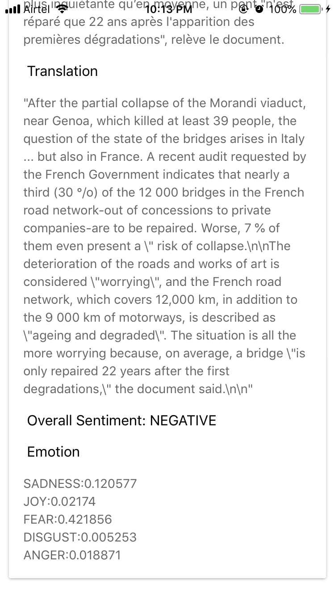

# Build a hybrid mobile app that can capture an image, recognize and translate text using Tesseract OCR & Watson Language Translator

In this Code Pattern, we will create a hybrid mobile app using Apache Cordova and Node.js server application running on IBM Cloud Kubernetes service that uses Tesseract OCR to recognize text in images and Watson Language Translator to translate the recognized text. This mobile app translates the recognized text from the images captured or uploaded from the photo album.

When the reader has completed this Code Pattern, they will understand how to:

* Use the Cordova mobile framework to build and deploy mobile app.
* Create Node.js apps that capture, recognize and translate text using Watson services.
* Deploy Tesseract OCR on IBM Cloud Kubernetes service to recognize text and bind Watson service to cluster.
* Translate recognized text using Watson Language Translator.


## Flow
1. The user interacts with the mobile app and captures an image or selects an image from the photo album.
2. The image is passed to the Node.js server application that is running on IBM Cloud Kubernetes service which uses Tesseract OCR to recognize text in an image.
3. Node.js app uses Watson language translator service to translate the recognized text.
4. Recognized text and language translator result is returned to the mobile app for display.

## Included components
* [IBM Cloud Container Service](https://console.bluemix.net/docs/containers/container_index.html): IBM Bluemix Container Service manages highly available apps inside Docker containers and Kubernetes clusters on the IBM Cloud.
* [Watson Language Translator](https://www.ibm.com/watson/services/language-translator/): IBM Watson Language Translator is a service that enables you to dynamically translate news, patents or conversational documents.

## Featured technologies
* [Apache Cordova](https://cordova.apache.org/): An an open-source mobile development framework to build hybrid mobile apps.
* [Node.js](https://nodejs.org/): An open-source JavaScript run-time environment for executing server-side JavaScript code.
* [Tesseract OCR](https://github.com/tesseract-ocr/): An open-source Optical Character Recognition(OCR) engine.

# Watch the Video

TODO

# Steps

This Code Pattern contains several pieces. The Node.js server application running on IBM Cloud Kubernetes service communicates with the Tesseract OCR and Watson Language Translator. Mobile application is built locally and run on the Android/iOS phone.

## 1. Clone the repo

Clone the `snap-and-translate` repo locally. In a terminal, run:

```
$ git clone https://github.ibm.com/riyamaro/snap-and-translate.git
$ cd snap-and-translate
```

## 2. Run Server application in a container on IBM Cloud with Kubernetes

Steps below will help you to deploy the `snap-and-translate/server` application into a container running on IBM Cloud, using Kubernetes.

Install the [pre-requisites](https://github.com/IBM/container-service-getting-started-wt/tree/master/Lab%200) before you begin with the steps.

### Steps

* Follow the instructions to [Create a Kubernetes Cluster,Setup CLI, Setup Private registry and to set up your cluster environment](https://console.bluemix.net/docs/containers/cs_tutorials.html#cs_cluster_tutorial).

* Set the Kubernetes environment to work with your cluster:

```
$ bx cs cluster-config <replace_with_your_cluster_name>
```

The output of this command will contain a KUBECONFIG environment variable that must be exported in order to set the context. Copy and paste the output in the terminal window. An example is:

```
$ export KUBECONFIG=/Users/riyaroy/.bluemix/plugins/container-service/clusters/<cluster_name>/kube-config-hou02-<cluster_name>.yml
```

* Add Language Translator service to your cluster

Add the Language Translator service to your IBM Cloud account by replacing with a name for your service instance.

```
$ bx service create create language_translator lite <service_name>
```

* Bind the Language Translator instance to the default Kubernetes namespace for the cluster. Later, you can create your own namespaces to manage user access to Kubernetes resources, but for now, use the default namespace. Kubernetes namespaces are different from the registry namespace you created earlier. Replace cluster name and service instance name.

```
$ bx cs cluster-service-bind --cluster <cluster_name> --namespace default --service <service_name>
```

Your cluster is configured and your local environment is ready for you to start deploying apps into the cluster.

* Build a Docker image that includes the app files from `snap-and-translate/server` directory, and push the image to the IBM Cloud Container Registry namespace that you created. Replace <ibmcloud_container_registry_namespace> with IBM Cloud Container Registry namespace.

```
$ docker build -t registry.ng.bluemix.net/<ibmcloud_container_registry_namespace>/watsontesseract:1 .
```

* Push the image to IBM Cloud Container registry

```
$ docker push registry.ng.bluemix.net/<ibmcloud_container_registry_namespace>/watsontesseract:1
```

* Update the `image` in `watson-lang-trans.yml` with your image name


* Run the configuration script.

```
$ kubectl apply -f watson-lang-trans.yml
```

* Get the public IP address by replacing the <cluster_name>. (Take a note of the Public IP address since it is required in the later steps) 

```
$ bx cs workers <cluster_name>
```

## 3. Deploy mobile application

Steps below will help you to deploy the `snap-and-translate/mobile` mobile application.

### 1. Update config values for the Mobile App

Edit `mobile/www/config.json` and update the setting with the Public IP address and NODE PORT( nodePort from `snap-and-translate/server/watson-lang-trans.yml`) retrieved previously.

```
"SERVER_URL": "http://<replace_public_ip_address>:<replace_node_port>/uploadpic"
```

### 2. Install Requirements to build the mobile application

For this Code Pattern, you'll need to at first install the prerequisites for Android and iOS, by following their respective documentation:

#### 2a. [Android requirements](https://cordova.apache.org/docs/en/latest/guide/platforms/android/index.html#requirements-and-support)

* [Java Development Kit (JDK)](http://www.oracle.com/technetwork/java/javase/downloads/jdk8-downloads-2133151.html)
* [Node.js and npm](https://nodejs.org/en/download/) (`npm` version 4.5.0 or higher)
* [Android Studio](https://developer.android.com/studio/), which includes Android tools and gives you access to Android SDKs
* [Cordova](https://cordova.apache.org/docs/en/latest/guide/platforms/android/index.html)
* [Gradle](https://gradle.org/install/)

You'll need to install the specific SDK appropriate for your mobile device. From `Android Studio`, download and install the desired API Level for the SDK. We are using Android API Level 23 as this is widely supported on most phones as of January, 2018. To do this:

* Launch `Android Studio` and accept all defaults.
* Click on the `SDK Manager` icon in the toolbar.
* Navigate to `Appearance & Behavior` -> `System Settings` -> `Android SDK`
* Select Android API level of your choice (Recommended Android 6.0 (Marshmallow) (API Level 23) and above).
* Click apply to download and install.

> Note: the `mobile/config.xml` is configured to build for Android API Level 23. Adjust this if you wish to build for a different API:
```
<preference name="android-targetSdkVersion" value="23" />
```

Once you have completed all of the required installs and setup, you should have the following environment variables set appropriately for your platform:

* `JAVA_HOME`
* `ANDROID_HOME`
* `PATH`

> Note: For additonal help setting these environment variables, refer to the Troubleshooting section in README.

#### 2b. [iOS requirements](https://cordova.apache.org/docs/en/latest/guide/platforms/ios/index.html#requirements-and-support)

* [Xcode](https://itunes.apple.com/us/app/xcode/id497799835?mt=12)
* [Deployment Tools](https://www.npmjs.com/package/ios-deploy)- To install it, run the following from command-line terminal: `npm install -g ios-deploy`

Installing Xcode will mostly set everything needed to get started with the native side of things. You should now be able to create and build a cordova project.

You need to do the following before deploying:

* Create a Provisioning Profile within the [iOS Provisioning Portal](https://developer.apple.com/ios/manage/overview/index.action). You can use its Development Provisioning Assistant to create and install the profile and certificate Xcode requires.

* Verify that the Code Signing Identity setting within the Code Signing section within the build settings is set to your provisioning profile name.


### 3. Add Android/iOS platform and plug-ins

Start by adding the Android/iOS platform as the target for your mobile app.

```
$ cd snap-and-translate/mobile
$ cordova platform add android
$ cordova platform add ios
```

Ensure that everything has been installed correctly:

```
$ cordova requirements
```

Finally, install the plugins required by the application:

```
$ cordova plugin add cordova-plugin-camera
$ cordova plugin add cordova-plugin-file-transfer
```

### 4. Build the App

Run the following command to build the project for all platforms:

```
$ cordova build
```

### 5. Run the App

Plug the mobile into your computer/laptop using USB cable and test the app directly by executing the command:

```
$ cordova run android (if you have android device)
$ cordova run ios (if you have iOS device)
```

> Android Studio will handle the transfer for you if you tether your Android device to your computer, and enable both `Developer Options` and `USB Debugging`.Please refer to documentation on your specific phone to set these options.

At this point, the app named `TranslateIt` should be on your mobile device. Use the camera button to take a photo of an image that has text or photo album button to select image from your album, and allow Tesseract OCR to extract text and Watson Language Translator to translate the recognized text.

# Sample output

  


# Troubleshooting

* `cordova run android` error: Failure [INSTALL_FAILED_UPDATE_INCOMPATIBLE]

> The `TranslateIt` app is already installed on your phone and incompatible with the version you are now trying to run. Uninstall the current version and try again.

* `cordova run android` error: No target specified and no devices found, deploying to emulator

> Ensure that your phone is plugged into your computer and you can access it from the Android File Transfer utility (see Step #6 above).

* How to determine proper values for environment variables:

Open `Android Studio` and navigate to `File` -> `Project Structure` -> `SDK
Location`. This location value will serve as the base for your environment variables. For example, if the location is `/users/joe/Android/sdk`, then:

```
$ export ANDROID_HOME=/users/joe/Android/sdk
$ export ANDROID_SDK_HOME=/users/joe/Android/sdk/platforms/android-<api-level>
$ export PATH=${PATH}:/users/joe/Android/sdk/platform-tools:/users/joe/Android/sdk/tools
```

* `ibmcloud cs cluster-service-bind --cluster <cluster_name> --namespace default --service <watson_service_name>`

Error: "This IBM cloud service does not support the Cloud Foundry service keys API and cannot be added to your Cluster"

This error message is likely occurring because the service instance has not fully instantiated. Please wait a few minutes and then try binding the service instance again.

# Links

* [Watson Node.js SDK](https://github.com/watson-developer-cloud/node-sdk):Visit the Node.js library to access IBM Watson services.
* [Create Kubernetes cluster](https://console.bluemix.net/docs/containers/cs_tutorials.html#objectives): Tutorial- Creating Kubernetes Cluster and adding Watson service to cluster.
* [Sample Node.js application for Language Translator](https://github.com/watson-developer-cloud/language-translator-nodejs): Sample Node.JS application for Watson Language Translator service

# Learn more

* **Artificial Intelligence Code Patterns**: Enjoyed this Code Pattern? Check out our other [AI Code Patterns](https://developer.ibm.com/code/technologies/artificial-intelligence/).
* **AI and Data Code Pattern Playlist**: Bookmark our [playlist](https://www.youtube.com/playlist?list=PLzUbsvIyrNfknNewObx5N7uGZ5FKH0Fde) with all of our Code Pattern videos
* **With Watson**: Want to take your Watson app to the next level? Looking to utilize Watson Brand assets? [Join the With Watson program](https://www.ibm.com/watson/with-watson/) to leverage exclusive brand, marketing, and tech resources to amplify and accelerate your Watson embedded commercial solution.

# License
[Apache 2.0](LICENSE)
